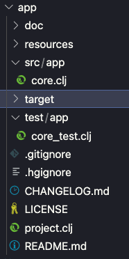
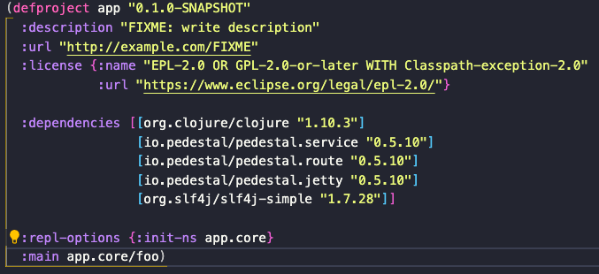
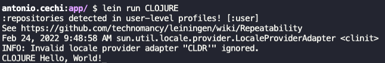
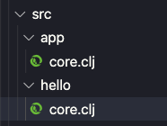

# Creating the project

Creating a clojure project is easy as creating a project using the dotnet cli.
Go to the terminal, open your development folder and type:

```sh
lein new app
```

The ``app`` in the end of the command is the lein template we're using. This is one of the most common templates, but there are others.
After the command concludes, you should have a folder structure like this one:



For now, we're interested in two itens in this structure: the ``src`` folder and the ``project.clj`` file.
In the project file, we can find the clojure version we're using and the dependencies of the project. In the source folder, we can put our clojure files.

The first thing we're gonna do is put some dependencies on the project file and configure the starting file.
Let's put the [pedestal] dependencies on our project:

```clojure
[io.pedestal/pedestal.service "0.5.10"]
[io.pedestal/pedestal.route "0.5.10"]
[io.pedestal/pedestal.jetty "0.5.10"]
[org.slf4j/slf4j-simple "1.7.28"]
```

And configure the main method of the project:

```clojure
:main app.core/foo
```

Your project file should look like this:



Let's test this changes:

```sh
lein run CLOJURE
```

If everything is ok, we gonna get our shinning hello world!



Well, well, all the things are working correctely, the project is good and all. Let's shift gears, and create a ``http server``, using [pedestal].
Create a new ``folder`` inside the ``src`` folder called ``hello``. Create a new file called ``core.clj``.



Inside this file, paste the following code:

```clojure
(ns hello.core
  (:require [io.pedestal.http :as http]
            [io.pedestal.http.route :as route]))

(defn respond-hello-world [request]
  {:status 200 :body "Hello World."})

(def routes
  (route/expand-routes
   #{["/hello" :get respond-hello-world :route-name :hello]}))

(defn create-server []
  (http/create-server
   {::http/routes routes
    ::http/type :jetty
    ::http/port 8890}))

(defn start[]
  (http/start (create-server)))
```

Change the ``main`` call in the ``project.clj`` to:

```clojure
:main hello.core/start
```

And run the ``lein`` command:

```sh
lein run
```

If we open the browser and type ``http://localhost:8890/hello``, we should have a nice and warm "Hello World" printed out.

---

## Analysing the code

Lets break down the code by the symbols:

```clojure
(ns hello.core
  (:require [io.pedestal.http :as http]
            [io.pedestal.http.route :as route]))
```

Here we do two things: we define the file and code ``namespace`` (```ns hello.core```) and we define the libraries we'll use (in this case, pedestal's ``http`` and ``route``).

```clojure
(defn respond-hello-world [request]
  {:status 200 :body "Hello World."})
```

In this part, we define a function that returns a ``map``containing the response status code and the body.

```clojure
(def routes
  (route/expand-routes
   #{["/hello" :get respond-hello-world :route-name :hello]}))
```

Here we define a ``symbol`` containing the routes availables to the app. The notation ``#{}`` defines a ``set``, so, when creating new routes, we can only create different routes.

```clojure
(defn create-server []
  (http/create-server
   {::http/routes routes
    ::http/type :jetty
    ::http/port 8890}))
```

Another function, this one calls the [pedestal]'s ``create-server`` function, passing the route symbol definition, the [jetty] web server and the port.

```clojure
(defn start[]
  (http/start (create-server)))
```

By the end, we create the startup function, that uses [pedestal]'s ``start`` function. This is the function we configure in the ``project.clj`` file.

---

## Mob and exercices

Using what we already know, and the provided resources, let's create:

- a new folder called ``greet``;
- inside the new folder, a new file called ``core.clj``
- replicate all the code from the ``hello.core``
- create a rote called ``greet`` that responds "Greetings" with 200 status code
- create a route called ``greetme``, thats receive a query parameter called ``name``, and responds "Greetings [name]";
- change the ``project.clj`` to start in this new file;

[//]: #
[pedestal]: <http://pedestal.io/>
[jetty]: <http://www.eclipse.org/jetty/>
